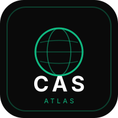

<p align="center">
  
</p>

<h1 align="center">CASAtlas</h1>

<p align="center">
  A modern, self-hosted, open-source CAS portfolio platform for IB students
</p>

<p align="center">
  <a href="https://github.com/vihaanvp/casatlas/actions"></a>
  <a href="LICENSE"></a>
  <a href="https://github.com/vihaanvp/casatlas/releases"></a>
</p>

---

## Overview

CASAtlas is a self-hosted web application designed for IB Diploma Programme students to document, manage, and reflect on their CAS (Creativity, Activity, Service) experiences. It provides a clean, modern interface for tracking your CAS journey with teacher oversight and approval workflows.

> **Current Status:** v0.1.0 Public Preview — core functionality is complete and stable. Teacher workflows, deployment improvements, and AI integrations are on the roadmap.

## Screenshots

> *Screenshots coming soon. The application features a dark-mode-first design with emerald green accents on a matte black background.*

## Features

- **Experience Management** — Create, edit, and organize CAS experiences with rich text descriptions
- **Evidence Upload** — Attach images, videos, PDFs, and links as supporting evidence
- **Reflections** — Write and preview rich text reflections for each experience
- **Dashboard** — Track your CAS progress with stats, recent activity, and goal tracking
- **Teacher Workflow** — Teachers can review, approve, and request revisions on student experiences
- **Comments** — Threaded commenting system for feedback and discussion
- **Admin Panel** — User management with role-based access control (Student, Teacher, Admin)
- **Audit Log** — Complete audit trail of all system actions
- **Search** — Full-text search across experiences and user profiles
- **Dark Mode** — Beautiful dark theme (default) with light mode option
- **OAuth Authentication** — Sign in with Google or GitHub
- **Self-Hosted** — Deploy with Docker in minutes, own your data

## Technology Stack

| Layer | Technology |
|-------|-----------|
| Framework | [Next.js 16](https://nextjs.org/) (App Router) |
| Language | [TypeScript 6](https://www.typescriptlang.org/) |
| UI | [React 19](https://react.dev/) + [Tailwind CSS 4](https://tailwindcss.com/) |
| Database | [PostgreSQL 16](https://www.postgresql.org/) + [Prisma 7](https://www.prisma.io/) |
| Authentication | [Auth.js v5](https://authjs.dev/) (NextAuth) |
| Testing | [Vitest](https://vitest.dev/) |
| Deployment | [Docker](https://www.docker.com/) + Docker Compose |

## Getting Started

### Prerequisites

- [Node.js](https://nodejs.org/) 20+
- [PostgreSQL](https://www.postgresql.org/) 16+
- [pnpm](https://pnpm.io/) 9+

### Development Setup

```bash
# Clone the repository
git clone https://github.com/vihaanvp/casatlas.git
cd casatlas

# Install dependencies
pnpm install

# Set up environment variables
cp .env.example .env.local
# Edit .env.local with your database URL and OAuth credentials

# Run database migrations
pnpm prisma migrate dev

# Start the development server
pnpm dev
```

Open [http://localhost:3000](http://localhost:3000) in your browser.

### Docker Deployment

The app ships as a multi-arch Docker image (linux/amd64 + linux/arm64) published to [GitHub Container Registry](https://github.com/vihaanvp/CASAtlas/pkgs/container/casatlas), with `docker-compose.yml` bundling PostgreSQL 16 + app. Zero-config quick start:

```bash
# Clone, then set up the Docker environment
git clone https://github.com/vihaanvp/CASAtlas.git
cd CASAtlas/docker
cp .env.example .env
# Edit .env: set a real AUTH_SECRET (openssl rand -base64 32)
# and OAuth credentials if you want social login.

# Pull the pre-built image and start (app + PostgreSQL)
docker compose up -d
```

The application will be available at [http://localhost:3000](http://localhost:3000). Migrations run automatically on container start. Data persists in named volumes (`postgres_data`, `uploads_data`); nothing is lost on restart or `docker compose up -d`.

**Build from source instead of pulling the image:**

```bash
docker compose up -d --build
```

**Use an external database** (e.g. managed Postgres): set `DATABASE_URL` in `docker/.env` to point at it and drop the `db` service. **Reverse proxy / non-localhost hostname:** set `NEXT_PUBLIC_APP_URL` to your public URL and keep `AUTH_TRUST_HOST=true`.

### Deploying without Docker

1. Provision PostgreSQL 16.
2. `cp .env.example .env` and set `DATABASE_URL`, `AUTH_SECRET`, `NEXT_PUBLIC_APP_URL`, and OAuth credentials.
3. `pnpm install`, then apply the schema:
   ```bash
   pnpm prisma migrate deploy
   pnpm db:seed          # optional: seed demo users (admin@ / teacher@casatlas.local)
   ```
4. Build and start:
   ```bash
   pnpm build
   pnpm start
   ```
   If you deploy behind a reverse proxy or on a non-localhost hostname, set `AUTH_TRUST_HOST=true` (see [Configuration](#configuration)) — Auth.js v5 requires trusting the host in production.

## Configuration

CASAtlas is configured via environment variables. See [`.env.example`](.env.example) for all available options.

### Authentication Setup

1. Create OAuth credentials:
   - [Google Cloud Console](https://console.cloud.google.com/) for Google OAuth
   - [GitHub Developer Settings](https://github.com/settings/developers) for GitHub OAuth

2. Set the environment variables:
   ```bash
   GOOGLE_CLIENT_ID=your-google-client-id
   GOOGLE_CLIENT_SECRET=your-google-client-secret
   GITHUB_CLIENT_ID=your-github-client-id
   GITHUB_CLIENT_SECRET=your-github-client-secret
   ```

3. Generate an auth secret:
   ```bash
   openssl rand -base64 32
   ```

4. **Production hardening:** leave `AUTH_DEV_LOGIN` unset or `false`. When it is `true`, the login page shows a passwordless "Sign in with email" form that signs in as **any** user whose email exists in the database — **do not enable it in production**.

### Environment Variables

| Variable | Description | Default |
|----------|-------------|---------|
| `DATABASE_URL` | PostgreSQL connection string | — |
| `AUTH_SECRET` | Auth.js session encryption key | — |
| `GOOGLE_CLIENT_ID` | Google OAuth client ID | — |
| `GOOGLE_CLIENT_SECRET` | Google OAuth client secret | — |
| `GITHUB_CLIENT_ID` | GitHub OAuth client ID | — |
| `GITHUB_CLIENT_SECRET` | GitHub OAuth client secret | — |
| `NEXT_PUBLIC_APP_URL` | Application URL | `http://localhost:3000` |
| `AUTH_URL` | Optional: canonical Auth.js URL if it differs from `NEXT_PUBLIC_APP_URL` (Auth.js v5 name; defaults to `NEXT_PUBLIC_APP_URL`) | — |
| `ALLOW_REGISTRATION` | Enable public registration | `true` |
| `AUTH_TRUST_HOST` | Trust the hostname Auth.js receives (`true` for proxies / non-localhost). **Production:** set it | `false` |
| `AUTH_DEV_LOGIN` | Dev-only passwordless email login. **Never enable in production** | `false` |
| `UPLOAD_DIR` | File upload directory | `./uploads` |
| `WIKI_REPO` | Git remote for the GitHub wiki (used by `pnpm wiki:publish`) | `https://github.com/<owner>/<repo>.wiki.git` |

## Project Structure

```
casatlas/
├── src/
│   ├── app/              # Next.js App Router pages and API routes
│   ├── modules/          # Feature modules (experiences, admin, teacher, uploads, auth)
│   ├── components/       # Shared UI components (dialog, sheet, buttons, etc.)
│   ├── hooks/            # React hooks (useDebounce)
│   ├── lib/              # Utilities, Prisma client, RBAC, audit logging
│   ├── config/           # Feature flags and configuration
│   └── types/            # Shared TypeScript types
├── prisma/               # Database schema
├── docker/               # Dockerfile and Docker Compose
├── docs/                 # Architecture Decision Records
├── tests/                # Test files
└── public/               # Static assets
```

## Roadmap

- [ ] **v0.2.0** — Enhanced teacher workflow with bulk actions
- [ ] **v0.3.0** — Cloud storage support (S3-compatible), deployment improvements
- [ ] **v0.4.0** — AI-powered reflection assistance, calendar integration
- [ ] **v1.0.0** — Stable release with full documentation

See the [CHANGELOG](CHANGELOG.md) for detailed release history.

## Contributing

Contributions are welcome! Please read our [Contributing Guide](CONTRIBUTING.md) for details on:

- Setting up the development environment
- Code style and conventions
- Commit message format
- Pull request process

## Security

If you discover a security vulnerability, please see our [Security Policy](SECURITY.md) for responsible disclosure instructions.

## License

This project is licensed under the [MIT License](LICENSE).

---

<p align="center">
  Built for the IB community.
</p>
